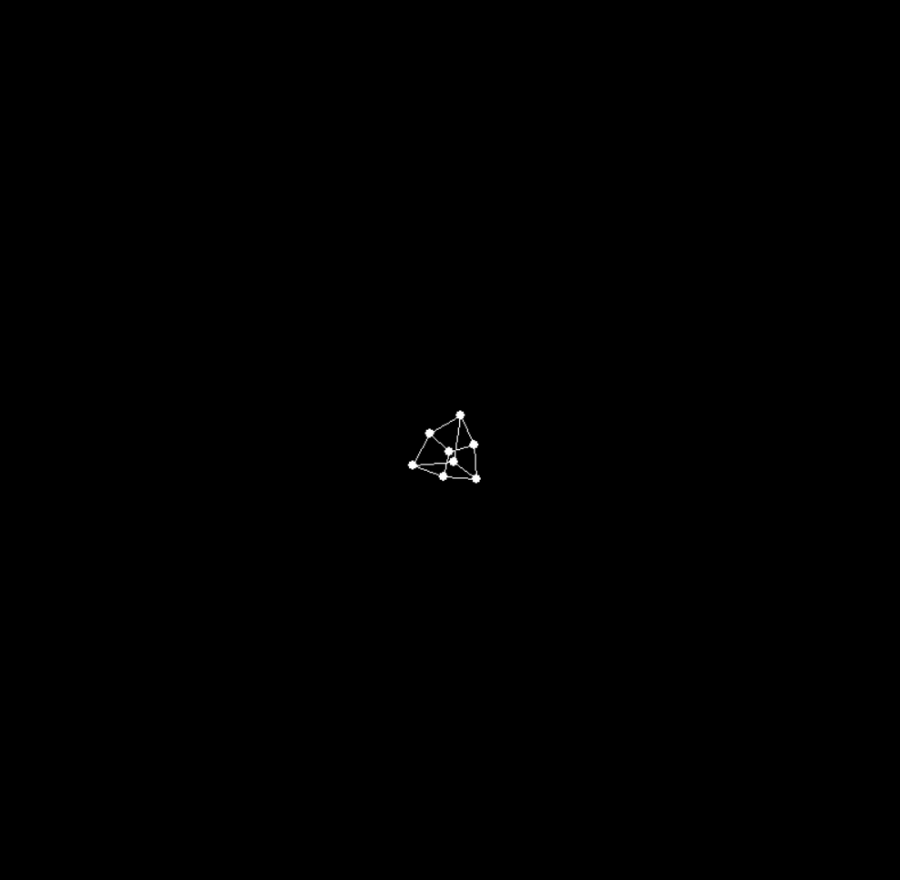

# Visualização de Rotação de Cubo 3D

## Introdução

Este projeto é uma visualização de rotação de cubo 3D baseada em Python usando Pygame. Ele demonstra os princípios da programação gráfica 3D, incluindo projeção, rotação e interação do usuário. O programa renderiza um cubo em wireframe que pode ser manipulado em tempo real, permitindo aos usuários explorar transformações e projeções em 3D.

## Controles de Movimento do Cubo

O cubo pode ser manipulado usando os seguintes controles de teclado:

- **W**: Mover o cubo para cima
- **S**: Mover o cubo para baixo
- **A**: Mover o cubo para a esquerda
- **D**: Mover o cubo para a direita
- **Q**: Aumentar a velocidade de rotação
- **E**: Diminuir a velocidade de rotação
- **R**: Mover o cubo para longe do espectador (aumentar a translação no eixo Z)
- **F**: Mover o cubo para mais perto do espectador (diminuir a translação no eixo Z)

Além disso, você pode dar zoom usando a roda de rolagem do mouse.

## Matemática de Matrizes Por Trás do Código

A rotação e projeção do cubo 3D são realizadas através de operações matriciais. Aqui está uma visão geral dos principais conceitos matemáticos usados:

1. **Matriz de Projeção**: 
   Esta matriz transforma as coordenadas 3D em coordenadas 2D na tela. Ela simula o efeito de perspectiva, onde objetos mais distantes parecem menores.

2. **Matrizes de Rotação**: 
   Três matrizes separadas lidam com a rotação em torno dos eixos X, Y e Z. Essas matrizes usam funções trigonométricas (seno e cosseno) para calcular as novas posições dos pontos após a rotação.

3. **Matriz de Translação**: 
   Esta matriz é usada para mover o cubo ao longo do eixo Z, criando o efeito de afastar ou aproximar o cubo do espectador.

4. **Multiplicação de Matrizes**: 
   A posição final de cada ponto é calculada multiplicando essas matrizes em sequência:
   Posição Final = Projeção * Translação * RotaçãoZ * RotaçãoY * RotaçãoX * Posição Inicial

# Gif Cubo

